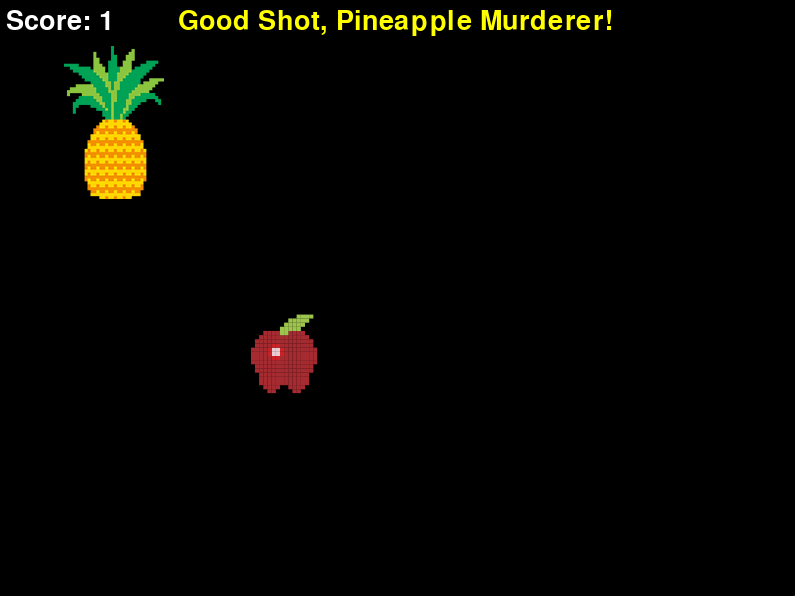

#  Fruit Shoot

A simple and fun game built using [Pygame Zero](https://pygame-zero.readthedocs.io/en/stable/) where your goal is to click the pineapple to earn points—without hitting the apple!

---

##  How to Play

1. **Download the Game:**
   - Go to the [Releases](https://github.com/Johnmcginnes168/Fruit-Shoot-Game/releases/tag/V1.1) tab on GitHub.
   - Download the **`Fruit_Shoot_V1.1.exe`** file from the assets section.

2. **Run the Game:**
   - Once the `.exe` file is downloaded, simply double-click on it to run the game.
   - The game will open in a separate window, and you can start playing right away!

3. **Gameplay Instructions:**
   - Click on the **pineapple** to score points (watch out for the **apple** — clicking it will cost you points!).
   - Try to get a high score, and enjoy the game!

4. **Replaying the Game:**
   - Once the game ends, click anywhere on the screen to restart and try again.

---

###  **Technical Requirements:**
- **Operating System:** Windows (The `.exe` file is built for Windows only).
- **No Installation Required:** Just download the `.exe` file, and you're ready to play!

---

### Bonus: **For Developers:**
If you're interested in the code, feel free to download the full source code and build the game yourself.

- Clone this repository or download the source.
- If you're running on your own machine, you’ll need Python 3.x installed, along with dependencies:
  - `pgzrun` (Pygame Zero)
  - `pygame`
  
---

## Features

- Moving targets 
- Collision detection
- Score system
- Game over screen with restart option
- Hilarious pineapple-related messaging

---

##  Built With

- Python 
- Pygame Zero

---

##  Future Ideas

- Add sounds when you click things
- Timer countdown mode
- High score tracking
- Exploding fruit animations (why not?)

---

##  Screenshots

---
